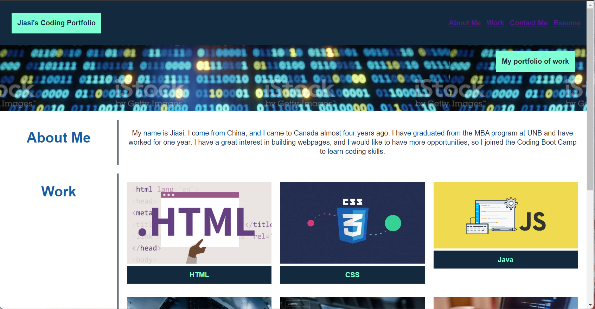
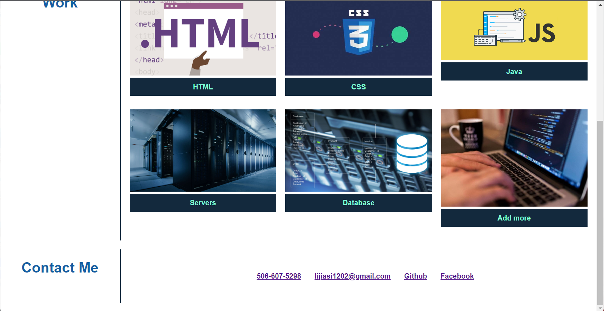
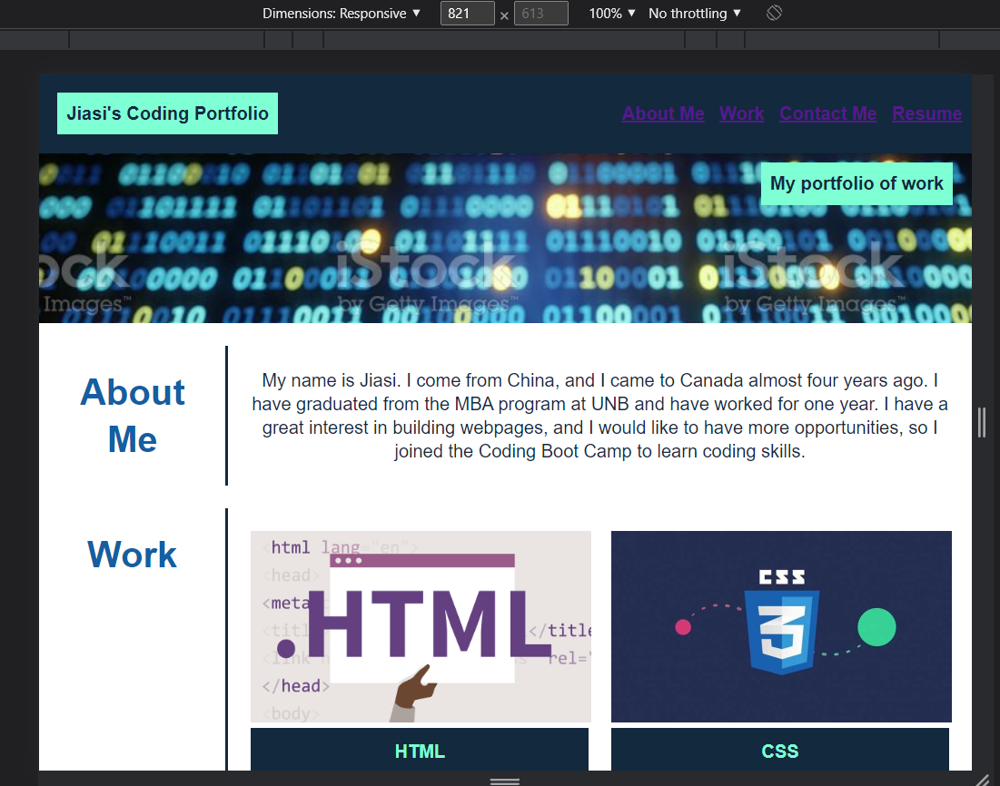
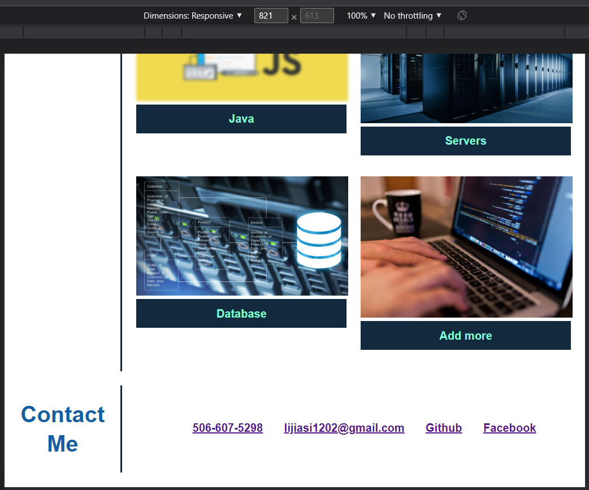
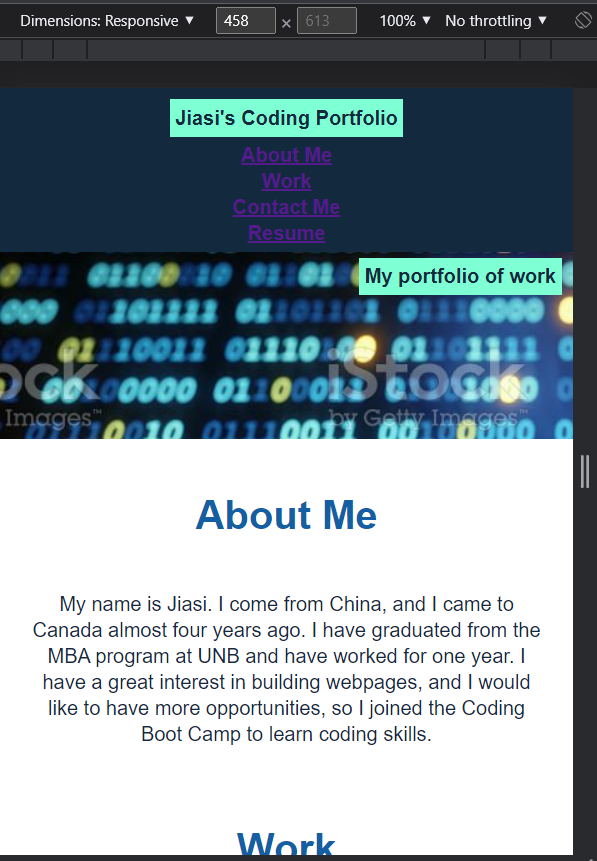
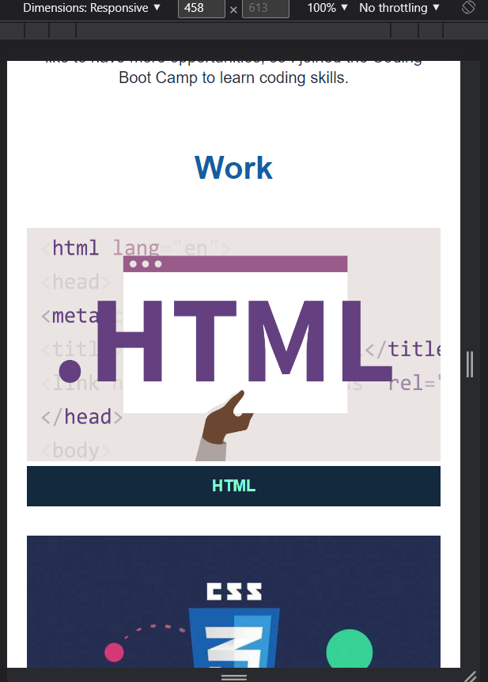
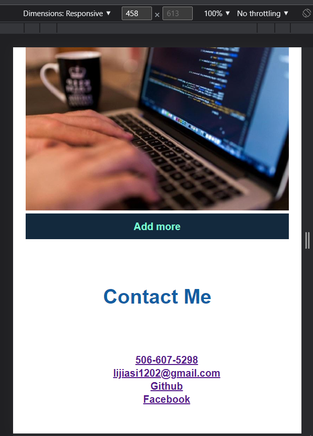

# 02 Advanced CSS: Portfolio

## Description
In week2-challenge, I create a webpage called Jiasi's portofolio, which contains my background, my work, and my contact information. 


## User Story

```
AS AN employer
I WANT to view a potential employee's deployed portfolio of work samples
SO THAT I can review samples of their work and assess whether they're a good candidate for an open position
```


## Acceptance Criteria

Here are the critical requirements necessary to develop a portfolio that satisfies a typical hiring manager’s needs:

```
GIVEN I need to sample a potential employee's previous work
WHEN I load their portfolio
THEN I am presented with the developer's name, a recent photo or avatar, and links to sections about them, their work, and how to contact them
WHEN I click one of the links in the navigation
THEN the UI scrolls to the corresponding section
WHEN I click on the link to the section about their work
THEN the UI scrolls to a section with titled images of the developer's applications
WHEN I am presented with the developer's first application
THEN that application's image should be larger in size than the others
WHEN I click on the images of the applications
THEN I am taken to that deployed application
WHEN I resize the page or view the site on various screens and devices
THEN I am presented with a responsive layout that adapts to my viewport
```

## Screenshot








## links
deployment url: https://jiasisi.github.io/week2-challenge/

repo url: https://github.com/Jiasisi/week2-challenge

## References
Background-1:
https://www.istockphoto.com/photo/it-background-binary-code-a04-gm480288438-68884809

HTML:
https://www.mvps.net/docs/basic-knowledge-regarding-html/

CSS:
https://rolwinreevan.com/tags/css

java:
https://www.creative-tim.com/blog/web-development/top-javascript-frameworks-watch-2020/

servers: 
https://www.trustradius.com/buyer-blog/bare-metal-servers-virtual-servers-and-containerization

database:
https://www.datadesignsystems.com/database-development-can-help-business/

coding:
https://www.thenewsminute.com/article/coding-new-literacy-5-programming-languages-master-jobs-future-84900

